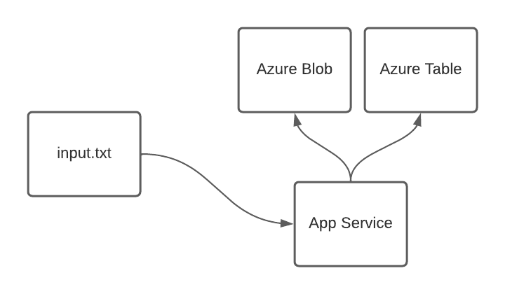

# Program 4

#### Author: Jaeha Choi

## Description

This program provides three features.

1. `load`
    - Attempts to download and parse the input file from the URL and upload it to the Azure blob and Azure table.
    - Blob gets overwritten(replaced) every time load is called.
    - Table gets updated(added/updated) every time load is called.
    - The input file is limited to 1 MB in size.
2. `clear`
    - Removes blob file, and drop table.
3. `query`
    - Search matching records and return them in a list.
    - First name and/or last name must be provided.

Service is available [here](https://css436-prog-4.azurewebsites.net/), until March 15th, 2022.

`input.txt` can be found [here](https://css436jchoi.blob.core.windows.net/prog4/index.txt), until March 15th, 2022.

## Design



### Program

1. Invalid input entries (lines) are ignored.
2. Write operations are blocking operations on the server-side, to prevent data race conditions.
3. The existing table is dropped upon the `clear` function and gets created again. The purpose of this design is to
   reduce the number of API calls and reduce execution time. Because dropping table doesn't happen instantly on Azure,
   this program creates a new table with `prog4` as a name prefix, followed by the Unix time in string. This design
   prevents tables with duplicated names.
4. The program requires four environment variables to run.
    ```shell
    # Storage Account name
    PROG_4_AZURE_ACCOUNT=
    # Storage Account secret key
    PROG_4_AZURE_KEY=
    # URL to a table Storage Account
    # Example: https://*mystorageaccount*.table.core.windows.net
    PROG_4_TABLE_URL=
    # URL to a Blob container
    # Example: https://*mystorageaccount*.blob.core.windows.net/*mycontainer*
    PROG_4_BLOB_URL=
    ```

### Development

1. Continuous integration is used to automate the build and deploy process.
2. Docker is used for publishing the program to Azure App Service.

## Monitoring

### Alerts and Metrics

Alerts can be set, which notifies the developer if certain metrics fail. App Service offers metrics related to HTTP
requests, along with hardware or Azure account-related metrics. Metrics can also be used for automatic scale-out
options.

Similarly, the Storage Account also provides alerts and metrics. One difference is that web app metrics (such as HTTP
response code) are replaced with storage-related metrics such as table count, blob count, etc.

### Software log

Logs are used for debugging and monitoring purposes. Users can set a log level, such as `debug`, `info`, etc.

## Scalability

### Storage Service

Scales automatically. Restrictions/limitations can be
found [here](https://docs.microsoft.com/en-us/azure/storage/common/scalability-targets-standard-account#scale-targets-for-standard-storage-accounts)

### App Service

1. Scale-up
    - App Service plan provides various options to scale up. Developers can choose hardware based on their needs. I was
      unable to find an option to automatically scale up.

2. Scale-out
    - App Service plan provides manual and automatic scale-out options. With the manual scaling option, developers can
      easily set up a number of instances to use. With the automatic scaling option, developers can pre-define the
      maximum and the minimum number of instances to scale out based on various metrics. Automatic scaling requires
      production instances, whereas manual scaling requires at least development instances.

### Software

The software provides limited scalability due to its functionality. For instance, users are unable to `clear`
/`load` simultaneously as `clear` and `load` both require write operation and could cause data race conditions with
concurrent write operations. However, the `query` function is capable of serving multiple users at the same time since
it does not contain any write operation.

In summary, the current design enforces the following rule:

1. `clear`/`load`
    - Wait for any ongoing functions(`clear`/`load`/`query`)
2. `query`
    - Wait for ongoing write functions(`clear`/`load`)

## Estimated SLA

Note: App Service price tier that I'm using does not provide SLA. Therefore, I will assume that this program is running
on a production environment.

Azure Blob and Azure Table are a subset of Azure Storage Service, but I'm unsure if they're running on the same
instance. Therefore, I will be presenting two different scenarios:

#### Blob and Table are running on the same instance:

- Estimated availability for a fully functional service is:
  > 0.9995 * 0.999 = 0.9985005 = **99.85%**
- This can be improved when using two (or more if needed) App Service instances:
  > (1 - ((1-0.9995) * (1-0.9995))) * 0.999 = 0.99899975025 = **99.9%**

#### Blob and Table are running on different instances

- Estimated availability for query function is:
  > 0.9995 * 0.999 = 0.9985005 = **99.85%**
- Estimated availability for a fully functional service is:
  > 0.9995 * 0.999 * 0.999 = 0.9975019995 = **99.75%**
- This can be improved when using two (or more if needed) App Service instances:
  > (1 - ((1-0.9995) * (1-0.9995))) * 0.999 * 0.999 = 0.99800075049975 = **99.8%**

Source:

- https://azure.microsoft.com/en-us/support/legal/sla/app-service/v1_5/
- https://azure.microsoft.com/en-us/support/legal/sla/storage/v1_5/

## Caveats

- The response is slow when accessing the website for the first time after idle. This feature seems to save compute
  time.
